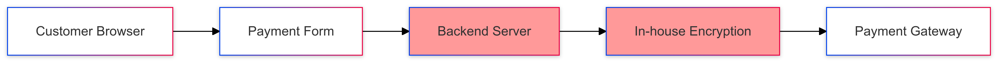
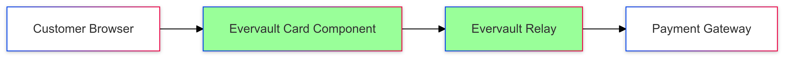

# Evervault Integration Analysis

## Architecture Diagrams

### Current Architecture (Estimated)

- Customer enters card details in browser
- Data is sent to backend server
- Server handles encryption and PCI compliance
- Encrypted data sent to payment gateway
- High security and compliance burden on internal team

### Proposed Architecture with Evervault

- Customer enters card details in Evervault-secured form
- Data automatically encrypted in the browser
- Evervault Relay handles secure data transmission
- Clean handoff to payment gateway
- PCI compliance handled by Evervault

## Analysis: In-house vs Evervault

### In-house Tokenisation
#### Pros
- Full control over implementation
- No additional vendor dependency
- One-time development cost

#### Cons
- PCI compliance burden (~£40K/year)
- Security team overhead (~1 FTE, £120K/year)
- Ongoing maintenance requirements
- Regular audit requirements
- Significant development time (3-6 months)
- Key rotation management

### Evervault Solution
#### Pros
- Immediate PCI compliance
- No dedicated security team needed
- Rapid implementation (1-2 weeks)
- Built-in audit trails
- Future-proof encryption
- Automated key rotation
- Reduced liability

#### Cons
- Monthly service cost
- Vendor dependency

### ROI Analysis (Year 1)
In-house Solution:
- Development: £160K
- PCI Compliance: £40K
- Security FTE: £120K
Total: £320K

Evervault Solution:
- Implementation: £16K
- Annual Licence: £48K
Total: £64K
Projected Year 1 Savings: £256K

## Next Steps

### Week 1: Technical Validation
- Set up sandbox environment
- Test integration with existing payment gateway
- Validate encryption/decryption flows
- Review sample implementation

### Week 2: Security Review
- Review Evervault's security documentation
- Assess compliance requirements
- Schedule technical deep-dive if needed
- Document security findings

### Week 3: Implementation Planning
- Define migration strategy
- Create implementation timeline
- Identify resource requirements
- Plan rollback procedures

### Week 4: Pilot Program
- Start with small transaction volume
- Monitor performance and security
- Gather metrics for full rollout
- Document lessons learned

## Success Metrics
- Successful encryption of card data
- Reduced PCI compliance scope
- Integration with existing systems
- Performance benchmarks met
- Security requirements satisfied

## Support and Resources
- Dedicated implementation support
- 24/7 security monitoring
- Regular security updates
- Compliance documentation
- Developer documentation