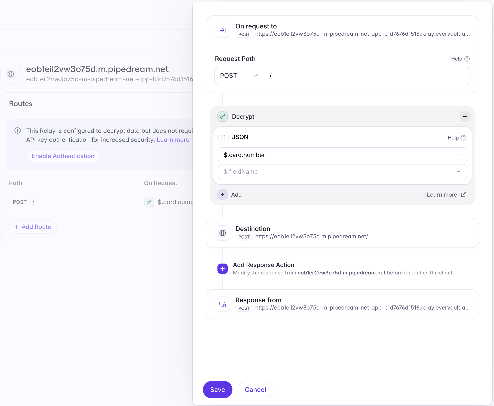
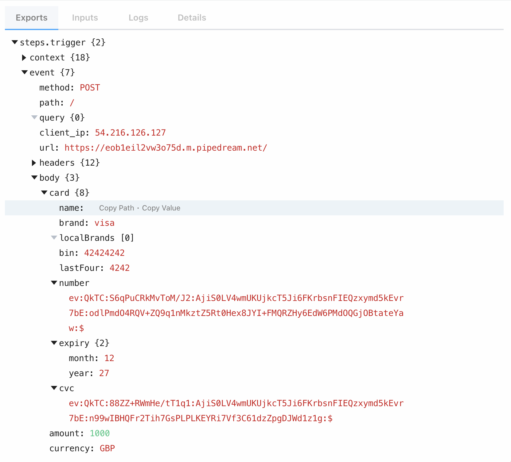
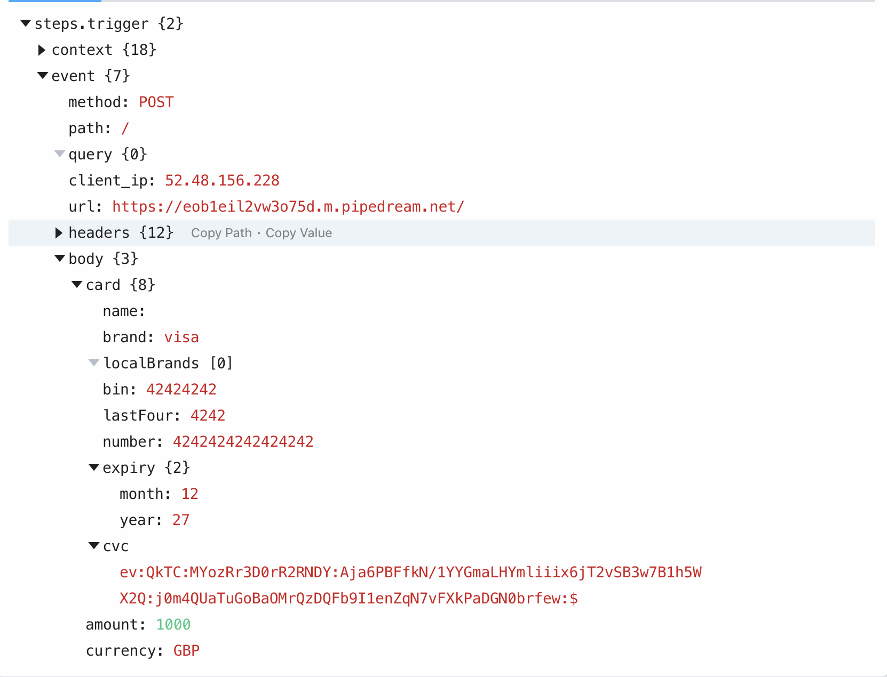

@anna Thanks for connecting everyone! I've put together some follow-up materials based on our discussion. 

One of the key challenges you mentioned was securely handling card data while maintaining flexibility in your payment flows. You need to:
1. Securely collect and store card information
2. Process payments without exposing sensitive data
3. Maintain PCI compliance without the overhead
4. Have control over when data is encrypted/decrypted

Let me show you how Evervault's Relay addresses these needs with a simple configuration:


👆 The Relay interface lets you control exactly which fields get decrypted


👆 Card data stays encrypted by default: "card.number": "ev:QkTC:WiCr95n0rB7z35FL:A6cWm3..."


👆 Data is only decrypted when and where you need it: "card.number": "4242424242424242"

This gives you the security you need with the flexibility your business requires. Now, let me address specific concerns for each team member:

@lucy (CFO) 
The financial impact analysis shows significant cost savings:
- Current estimated costs (Year 1): $400K
  • PCI compliance: $50K
  • Security FTE: $150K
  • Development: $200K
- Evervault solution: $80K
  • Implementation: $20K
  • Annual license: $60K
**Projected Year 1 savings: $320K**

@james (Staff Engineer)
I've created a minimal demo showing the integration:
1. Drop-in card component with automatic encryption:

```
<EvervaultCard
onChange={(event) => {
if (event.isValid) {
// Card data is automatically encrypted
handlePayment(event.card);
}
}}
/>
```

2. Backend relay (handles decryption):
```
@app.route('/api/process-payment', methods=['POST'])
def process_payment():
# Data arrives pre-encrypted
response = requests.post(
RELAY_URL,
json=payment_data,
headers={"Evervault-Decrypt": "true"}
)
```


3. Relay Configuration (in Evervault Dashboard):
- Set specific fields to decrypt: `$.card.number`
- Keep other fields encrypted
- Control decryption per destination
- Add authentication for increased security

This gives you:
- Granular control over what data remains encrypted
- Flexibility to store encrypted or decrypted values
- Field-level decryption rules
- Secure data handling without complex key management

The full demo is in our shared GitHub repo. Would you like to schedule a technical deep-dive to discuss the encryption/decryption flows in more detail?

The full demo is in our shared GitHub repo.

@stephen (Head of Product)
From a product perspective, this means:
- Immediate PCI compliance
- 1-2 week implementation vs 3-6 months
- No changes to user experience
- Future-proof for new payment methods

Proposed next steps:
1. Week 1: Technical validation
   - Set up sandbox environment
   - Test with your payment gateway
2. Week 2: Security review
   - Review compliance requirements
   - Technical deep-dive
3. Week 3: Implementation planning
   - Migration strategy
   - Timeline and resources
4. Week 4: Pilot program
   - Start with small volume
   - Monitor and gather metrics

Would anyone like to schedule a deeper dive into their specific area? I'm happy to set up follow-up calls to discuss the technical, financial, or product aspects in more detail.